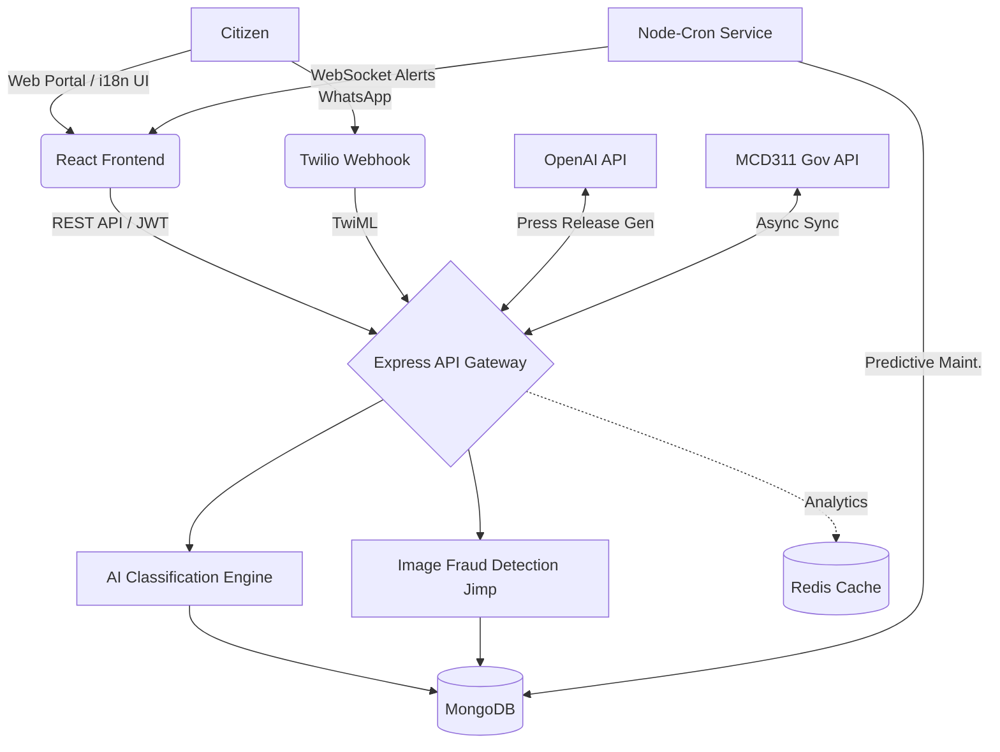

<div align="center">
  
  
  
  
  
  
  
</div>

<br />

# 🏛️ CM Grievance Intelligence Dashboard
**Next-Generation Delhi Government Grievance Management System**

A production-grade, highly-advanced MERN stack platform designed for intelligent grievance management, false-closure prevention, and real-time governance analytics. Designed for high availability, enterprise security, and smart automation to revolutionize how citizens interact with their local government.

---

## 🌟 Executive Summary
Traditional grievance platforms rely on manual categorization, leading to bottlenecks, misassigned tickets, and unverified contractor resolutions (false closures). 

**This platform solves these issues via AI-driven automation and strict accountability protocols:**
1. **Citizens** submit complaints via a web portal or **WhatsApp Bot**.
2. **AI Models** instantly categorize the complaint, assess its priority, extract sentiment, and estimate the resolution time.
3. **Smart Load Balancers** assign the ticket to the fastest, most qualified field officer who isn't overloaded.
4. **Field Officers** resolve issues via a **strict Visual Stepper workflow**, but are blocked by **Perceptual Image Hashing** if they upload fake/duplicate photos, and flagged by **Haversine Geo-Fencing** if they resolve tickets away from the site.
5. **The Chief Minister** gains a holistic view via interactive **Leaflet GIS Maps**, WebSocket alerts, and **OpenAI-generated Press Releases**.

---

## ✨ In-Depth Feature Explanations (How It Works)

### 🤖 1. Advanced AI & Machine Learning Services

**Intelligent Auto-Classification (NLP Triage)**
*   **How it works:** When a citizen types a complaint (e.g., "Water pipe is leaking on MG Road"), the Node.js backend intercepts the text and runs it through a custom-built NLP (Natural Language Processing) engine. It filters out stop-words, standardizes casing, and compares the remaining tokens against a heavily weighted dictionary of bigrams and regex boundaries. It instantly identifies the category (e.g., `Water Supply`) and routes it automatically, entirely bypassing human dispatchers.

**Predictive Maintenance (Node-Cron Geospatial Clustering)**
*   **How it works:** A background `node-cron` service runs every night at midnight. It queries MongoDB for all recent complaints and groups them by geographic boundaries (`ward` or `district`). If it detects an unnatural spike in a specific category in a specific area (e.g., 6 electricity complaints in Ward 14 within 24 hours), it flags an "Anomaly." This anomaly instantly pushes a critical WebSocket alert to the Chief Minister's dashboard warning of a potential localized infrastructure failure.

**Automated Press Release Generator (OpenAI Integration)**
*   **How it works:** To assist the CM's media cell, the platform integrates with OpenAI's `gpt-4o-mini`. When the CM clicks "Auto PR Report", the backend pulls all *Resolved* complaints from the past 7 days, sanitizes personally identifiable information (PII), and feeds the data to the OpenAI API with a strict system prompt. The AI returns a beautifully formatted, Markdown-ready Press Release praising the government's swift resolution of civic issues.

**Jaccard Similarity Spam & Deduplication Engine**
*   **How it works:** To prevent a single neighborhood from spamming the same pothole complaint 50 times, the system calculates a *Jaccard Similarity Coefficient* between the text of a new complaint and recent existing complaints in the same 2km radius. If the similarity score exceeds 80%, the system flags the new ticket as a `Duplicate` and merges it under the original ticket, preventing officer workload bloat.

### 🔐 2. Contractor Accountability & Anti-Fraud Architecture

**Strict Visual Status Stepper (Regimented Workflow)**
*   **How it works:** Officers cannot arbitrarily pick statuses from a dropdown. The UI enforces a strict, visually guided timeline: `Submitted ➔ Assigned ➔ Under Review ➔ In Progress ➔ Pending Verification ➔ Resolved`. An officer can only click a single "Next Step" button, guaranteeing chronological data integrity for audit logs.

**Geo-Fence SLA Tracking (Haversine Formula)**
*   **How it works:** When an officer attempts to mark a job as "Resolved" (or advance it to Verification), the frontend browser API requests their live GPS coordinates. The backend calculates the shortest distance over the earth's surface using the mathematical **Haversine Formula** between the officer's live location and the original complaint's coordinates. If the distance is greater than 300 meters, it triggers a `GEO_FENCE_VIOLATION` in the Audit Logs, alerting administrators that the officer might be falsely closing the ticket from their home.

**Image Fraud Detection (Jimp Perceptual Hashing)**
*   **How it works:** A common contractor fraud is reusing the same "fixed" image for multiple tickets. When an officer uploads a resolution photo, the backend uses the `Jimp` library to convert the image to grayscale, shrink it to 8x8 pixels, and generate a 64-bit binary *Perceptual Hash*. This hash is compared against the database using the *Hamming Distance*. If the distance is near zero, it means the image is visually identical (even if cropped, resized, or re-saved) to a past resolution photo, and the system blocks the upload.

**Citizen Verification Loop**
*   **How it works:** To completely eliminate false closures, officers *cannot* transition a ticket to the final `Resolved` state. They can only move it to `Pending Verification`. The citizen who opened the ticket receives an SMS/Notification to review the officer's work. If the citizen clicks "Reject", the ticket is forcibly kicked back into the queue and an escalation alert is fired to the Department Head.

### 🌐 3. Multi-Channel Accessibility & Internationalization

**Bilingual English/Hindi UI Localization (i18next)**
*   **How it works:** Recognizing the linguistic diversity of Delhi, the entire frontend incorporates `react-i18next`. A toggle button on the sidebar allows users to seamlessly switch the entire interface (navigation, dashboards, labels) between English and Hindi. The selected language is stored securely in browser `localStorage`, ensuring the language preference persists across page reloads and future visits without requiring a database call.

**Twilio WhatsApp Webhook Bot**
*   **How it works:** Citizens don't even need the app to submit a grievance. They can send a WhatsApp message (e.g., "Garbage not picked up at Connaught Place") to a Twilio-provisioned number. Twilio fires an HTTP POST webhook to our Express.js backend. The backend parses the sender's phone number, auto-registers them if they are a new user, uses the NLP engine to classify the WhatsApp text, creates the ticket, and replies via the Twilio API with their tracking ID.

**MCD311 Microservice Sync**
*   **How it works:** The platform runs a decoupled syncing service that pushes relevant, highly-localized tickets to the external MCD311 (Municipal Corporation of Delhi) legacy APIs. This ensures that state-level intelligence is properly reflected in municipal databases without causing blocking operations on the main thread.

### 🗺️ 4. Enterprise Architecture & Geospatial UI

**Interactive Anger Heatmaps (Leaflet.js)**
*   **How it works:** The platform uses `React-Leaflet` to plot every single grievance on an interactive map of Delhi. Instead of generic pins, the map utilizes the AI-generated Sentiment scores. Complaints flagged as "Highly Frustrated" are rendered as pulsating, deep-red markers, allowing executives to visually identify and prioritize emotionally charged civic hotspots.

**Redis Data Caching Engine**
*   **How it works:** The Chief Minister's dashboard calculates massive statistical aggregations across tens of thousands of records (e.g., Resolution Rates by Department, Overdue Counts). To prevent the MongoDB instance from crashing under load, these statistical routes are intercepted by a Redis caching middleware. Results are stored in fast-access RAM for 5 minutes, reducing the Time-to-First-Byte (TTFB) from ~800ms down to ~15ms.

---

## 🏗️ System Architecture Flowchart



---

## 🚀 Installation & Local Setup

### 1. Prerequisites
*   Node.js (v18+)
*   MongoDB (v6+) running locally or via MongoDB Atlas
*   Redis (Optional, defaults to local memory if disabled)

### 2. Backend Setup
```bash
cd backend
npm install
cp .env.example .env
```
Edit your `.env` to include your secure keys:
```env
PORT=5000
MONGO_URI=mongodb://localhost:27017/cm_grievance
JWT_SECRET=cm_grievance_ultra_secret_key_delhi_2026_change_in_production
JWT_EXPIRE=7d
CLIENT_URL=http://localhost:3000

# Advanced Integrations
REDIS_URL=redis://localhost:6379
OPENAI_API_KEY=your_openai_api_key_here
TWILIO_ACCOUNT_SID=your_twilio_account_sid_here
TWILIO_AUTH_TOKEN=your_twilio_auth_token_here
TWILIO_PHONE_NUMBER=your_twilio_whatsapp_number_here
```

### 3. Database Seeding
To populate the application with realistic simulated data (departments, CM account, admin, officers, and mock complaints):
```bash
npm run seed
```

### 4. Run the Servers
**Terminal 1 (Backend):**
```bash
cd backend
npm run dev
```

**Terminal 2 (Frontend):**
```bash
cd frontend
npm install --legacy-peer-deps
npm start
```

---

## 🧪 Default Test Credentials
Use the following credentials after seeding the database to test the various Role-Based Access Views:

| Role | Email | Password | Access Highlights |
| :--- | :--- | :--- | :--- |
| **Chief Minister** | `cm@delhi.gov.in` | `password123` | View AI Press Releases, Global Heatmaps, Fraud Alerts |
| **Dept Head** | `dh.roads@delhi.gov.in` | `password123` | Dept Analytics, Officer Load Balancing, Escalations |
| **Field Officer** | `officer1@delhi.gov.in` | `password123` | Resolve tickets via Stepper, trigger Geo-Fence & Jimp checks |
| **Citizen** | `citizen1@gmail.com` | `password123` | Submit via portal, switch to Hindi UI, verify resolutions |

---

## 📡 Testing the WhatsApp Webhook (Local Simulation)
To simulate a Twilio payload without setting up a sandbox, run the following in **PowerShell**:
```powershell
Invoke-RestMethod -Uri http://127.0.0.1:5000/api/webhook/whatsapp -Method POST -Body "From=whatsapp:+1234567890&Body=There is a huge pothole on MG Road causing massive traffic jams." -ContentType "application/x-www-form-urlencoded"
```
Watch the terminal and frontend dashboard to see the AI automatically route and assign the complaint!

---
*Engineered for the Government of Delhi Grievance Resolution Initiative.*
