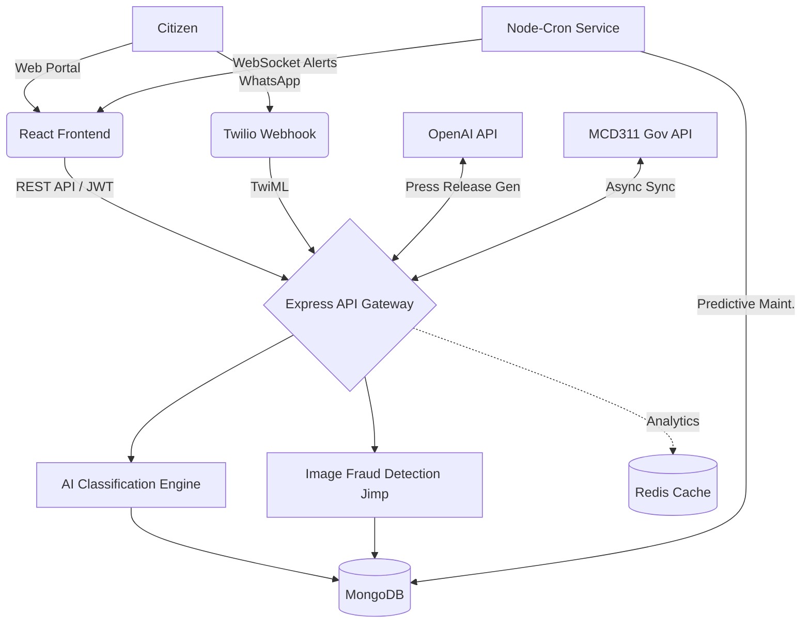

<div align="center">
  
  
  
  
  
  
</div>

<br />

# 🏛️ CM Grievance Intelligence Dashboard
**Next-Generation Delhi Government Grievance Management System**

A production-grade, highly-advanced MERN stack platform designed for intelligent grievance management, false-closure prevention, and real-time governance analytics. Designed for high availability, enterprise security, and smart automation to revolutionize how citizens interact with their local government.

---

## 🌟 Executive Summary
Traditional grievance platforms rely on manual categorization, leading to bottlenecks, misassigned tickets, and unverified contractor resolutions (false closures). 

**This platform solves these issues via AI-driven automation and strict accountability protocols:**
1. **Citizens** submit complaints via a web portal or **WhatsApp Bot**.
2. **AI Models** instantly categorize the complaint, assess its priority, extract sentiment, and estimate the resolution time.
3. **Smart Load Balancers** assign the ticket to the fastest, most qualified field officer who isn't overloaded.
4. **Field Officers** resolve issues but are blocked by **Perceptual Image Hashing** if they upload fake/duplicate photos, and flagged by **Haversine Geo-Fencing** if they resolve tickets away from the site.
5. **The Chief Minister** gains a holistic view via interactive **Leaflet GIS Maps**, WebSocket alerts, and **OpenAI-generated Press Releases**.

---

## ✨ Comprehensive Feature Matrix

### 🤖 1. Advanced AI & Machine Learning Integrations
*   **Intelligent Auto-Classification:** Eliminates manual triage. Uses a TF-IDF-inspired algorithm, bigram matching, and Regex boundary detection to classify text into 15+ civic categories.
*   **Skill-Based Auto-Assignment:** Assigns tickets to the specific field officer with the fastest historical resolution speed for that specific category, without exceeding their `bandwidth` capacity.
*   **Jaccard Similarity Deduplication:** Proactively blocks spam by detecting duplicate complaints using Jaccard similarity coefficients and geographic proximity.
*   **Predictive Maintenance (CRON):** Background service clusters complaints by geospatial boundaries. If an anomaly is detected (e.g., 5 sewage leaks in Ward A), it triggers a preemptive infrastructure alert via WebSockets.
*   **Automated Press Release Generator (OpenAI):** The CM dashboard connects directly to the `gpt-4o-mini` API to instantly compile weekly resolved tickets into professional, publishable Markdown press releases.
*   **Sentiment & Frustration Analytics:** Analyzes phrasing, exclamation density, and negative keywords to attach a "frustration index" to complaints.

### 🔐 2. Contractor Accountability & Anti-Fraud Engines
*   **Geo-Fence SLA Tracking (Haversine Formula):** Forces officers to be physically present to close a ticket. If an officer's GPS coordinates are > 300 meters away from the reported incident, an Audit Log is generated and the CM is alerted.
*   **Image Fraud Detection (Jimp Perceptual Hashing):** Extracts 64-bit perceptual hashes from uploaded resolution photos. It calculates the Hamming Distance against thousands of historical photos to catch contractors uploading previously used photos to falsely claim a resolution.
*   **Citizen Verification Loop:** Officers cannot truly "close" a ticket. They can only mark it `pending_verification`. The citizen receives an alert to confirm or reject the resolution. Rejections auto-escalate the ticket to Department Heads.

### 🌐 3. Multi-Channel & External API Integrations
*   **Twilio WhatsApp Webhook:** Citizens can register grievances seamlessly by sending a simple WhatsApp message! The backend automatically captures the TwiML payload, creates a user account on-the-fly, and replies with a tracking ID.
*   **MCD311 Microservice Sync:** Runs asynchronously to sync localized municipal tickets to the central MCD311 legacy APIs, ensuring data parity between state and municipal governments.
*   **Redis Data Caching:** Heavy analytical queries (dashboard stats, historical trends) are cached in Redis to guarantee ultra-fast UI rendering under high traffic.

### 🗺️ 4. Geospatial UI & Data Visualization
*   **Interactive Anger Heatmaps (Leaflet.js):** Dynamic GIS map plotting every grievance across Delhi. Highly frustrated complaints actively pulsate in red to demand immediate intervention.
*   **Real-time WebSocket UI:** Built with Socket.IO to push live notifications to the UI for Overdue Tickets, New Assignments, Verification Requests, and Predictive Maintenance Alerts.
*   **Role-Based Access Control (RBAC):** UI adapts seamlessly based on the logged-in user (Citizen, Employee, Department Head, Super Admin, Chief Minister).

---

## 🏗️ System Architecture



---

## 🚀 Installation & Local Setup

### 1. Prerequisites
*   Node.js (v18+)
*   MongoDB (v6+) running locally or via MongoDB Atlas
*   Redis (Optional, defaults to local memory if disabled)

### 2. Backend Setup
```bash
cd backend
npm install
cp .env.example .env
```
Edit your `.env` to include your secure keys:
```env
PORT=5000
MONGO_URI=mongodb://localhost:27017/cm_grievance
JWT_SECRET=cm_grievance_ultra_secret_key_delhi_2026_change_in_production
JWT_EXPIRE=7d
CLIENT_URL=http://localhost:3000

# Advanced Integrations
REDIS_URL=redis://localhost:6379
OPENAI_API_KEY=your_openai_api_key_here
TWILIO_ACCOUNT_SID=your_twilio_account_sid_here
TWILIO_AUTH_TOKEN=your_twilio_auth_token_here
TWILIO_PHONE_NUMBER=your_twilio_whatsapp_number_here
```

### 3. Database Seeding
To populate the application with realistic simulated data (departments, CM account, admin, officers, and mock complaints):
```bash
npm run seed
```

### 4. Run the Servers
**Terminal 1 (Backend):**
```bash
cd backend
npm run dev
```

**Terminal 2 (Frontend):**
```bash
cd frontend
npm install
npm start
```

---

## 🧪 Default Test Credentials
Use the following credentials after seeding the database to test the various Role-Based Access Views:

| Role | Email | Password | Access Highlights |
| :--- | :--- | :--- | :--- |
| **Chief Minister** | `cm@delhi.gov.in` | `password123` | View AI Press Releases, Global Heatmaps, Fraud Alerts |
| **Dept Head** | `dh.roads@delhi.gov.in` | `password123` | Dept Analytics, Officer Load Balancing, Escalations |
| **Field Officer** | `officer1@delhi.gov.in` | `password123` | Resolve tickets, trigger Geo-Fence & Jimp Hash checks |
| **Citizen** | `citizen1@gmail.com` | `password123` | Submit via portal, track status, verify resolutions |

---

## 📡 Testing the WhatsApp Webhook (Local Simulation)
To simulate a Twilio payload without setting up a sandbox, run the following in **PowerShell**:
```powershell
Invoke-RestMethod -Uri http://127.0.0.1:5000/api/webhook/whatsapp -Method POST -Body "From=whatsapp:+1234567890&Body=There is a huge pothole on MG Road causing massive traffic jams." -ContentType "application/x-www-form-urlencoded"
```
Check your terminal or frontend dashboard to watch the AI automatically route and assign the complaint!

---
*Developed for the Government of Delhi Grievance Resolution Initiative.*
